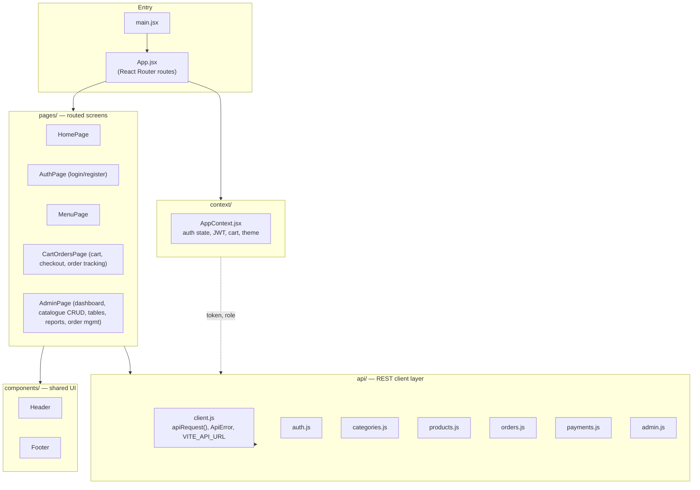
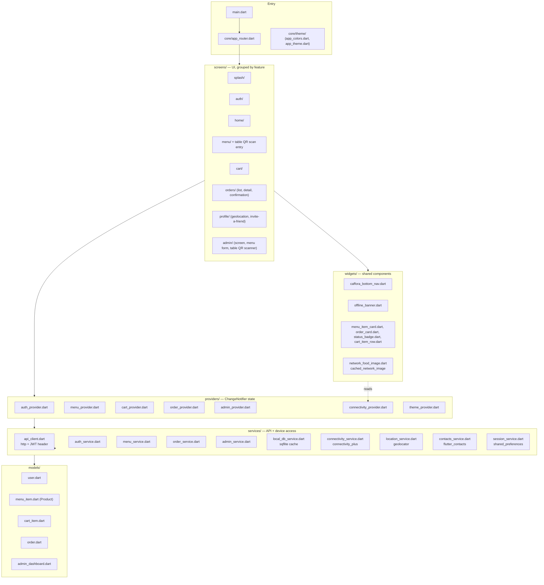

# Component Diagrams

This document breaks each of the three codebases into its internal layers /
modules. Package and folder names below match the real repository layout
under `backend/src/main/java/com/caffora/backend/`, `web/src/`, and
`mobile/lib/`. Where the authoritative spec calls for entities that are
being added as part of the in-progress work (`Category`, `Product`,
`CafeTable`, `Payment`, the `/admin/reports/*` endpoints), they are shown in
their target/final location, since that is what all three clients are
built against.

## Backend — Spring Boot layered architecture

```mermaid
flowchart TB
    subgraph config["config/"]
        SecurityConfig
        CorsProperties
        PricingProperties
        AdminSeedProperties
        DataSeeder
    end

    subgraph security["security/"]
        JwtAuthFilter["JwtAuthenticationFilter"]
        JwtService
        JwtProperties
        UserDetailsSvc["CustomUserDetailsService"]
        UserPrincipal
    end

    subgraph controller["controller/"]
        AuthController
        CategoryController
        ProductController
        TableController
        OrderController
        PaymentController
        AdminController
    end

    subgraph service["service/"]
        AuthService
        CategoryService
        ProductService
        TableService
        OrderService
        PaymentService
        AdminService["AdminService\n(dashboard + reports)"]
    end

    subgraph repository["repository/"]
        UserRepo["UserRepository"]
        CategoryRepo["CategoryRepository"]
        ProductRepo["ProductRepository"]
        TableRepo["CafeTableRepository"]
        OrderRepo["OrderRepository"]
        OrderItemRepo["OrderItemRepository"]
        PaymentRepo["PaymentRepository"]
    end

    subgraph model["model/ (JPA entities)"]
        User
        Category
        Product
        CafeTable
        Order
        OrderItem
        Payment
        Role["Role (enum)"]
        ProductStatus["ProductStatus (enum)"]
        OrderStatus["OrderStatus (enum)"]
        PaymentMethod["PaymentMethod (enum)"]
        PaymentStatus["PaymentStatus (enum)"]
    end

    subgraph dto["dto/ (request/response records)"]
        AuthDtos["auth/*"]
        ProductDtos["product/*"]
        OrderDtos["order/*"]
        PaymentDtos["payment/*"]
        AdminDtos["admin/DashboardResponse, SalesReportResponse, TopProductResponse"]
    end

    subgraph exception["exception/"]
        GlobalExceptionHandler
        ResourceNotFoundException
        BadRequestException
        EmailAlreadyInUseException
    end

    controller --> service
    controller -. "reads/writes" .-> dto
    service --> repository
    service -. "maps to/from" .-> dto
    repository --> model
    security --> controller
    config --> security
    controller --> exception
```

**Layer responsibilities:**

- **`config/`** — Spring `@Configuration` classes: `SecurityConfig` wires the
  JWT filter chain and per-route role rules; `CorsProperties` binds
  `CORS_ALLOWED_ORIGINS`; `PricingProperties` binds tax rate and pickup fee;
  `DataSeeder` creates the bootstrap `ADMIN_SEED_EMAIL` account on first
  startup if it does not already exist.
- **`security/`** — stateless JWT machinery: `JwtService` issues/validates
  tokens (jjwt 0.12), `JwtAuthenticationFilter` runs once per request to
  populate the Spring Security context from the `Authorization: Bearer`
  header, `CustomUserDetailsService` + `UserPrincipal` bridge the `User`
  entity into Spring Security's model.
- **`controller/`** — thin `@RestController` classes: parse/validate the
  HTTP request (via `@Valid` DTOs), delegate to a service, map the result to
  a response DTO. No business logic lives here.
- **`service/`** — business logic: password hashing and JWT issuance
  (`AuthService`), catalogue CRUD (`CategoryService`, `ProductService`),
  table/QR lookup (`TableService`), order placement and status transitions
  including **server-side total recomputation** (`OrderService`), simulated
  payment capture (`PaymentService`), and the aggregate queries behind the
  dashboard and reports (`AdminService`).
- **`repository/`** — Spring Data JPA interfaces over each entity; carry the
  `@Query`/derived-query methods used for the GROUP BY reporting queries
  (e.g. `OrderItemRepository.sumQuantityAndRevenueByProduct(...)`).
- **`model/`** — JPA `@Entity` classes mapping 1:1 to the seven database
  tables in `docs/database/erd.md`, plus enums for `Role`, `ProductStatus`,
  `OrderStatus`, `PaymentMethod`, `PaymentStatus`.
- **`dto/`** — request/response shapes exposed over HTTP; entities are never
  serialized directly, so internal fields (e.g. password hash) can never
  leak and API shape can evolve independently of the schema.
- **`exception/`** — `GlobalExceptionHandler` (`@RestControllerAdvice`)
  converts domain exceptions and validation failures into a consistent JSON
  error body (`status`, `message`, `fieldErrors`, `timestamp`, `path`) that
  every client (web `ApiError`, mobile `ApiException`) parses uniformly.

## Web — React component structure

- **`api/`** is the only layer that knows about HTTP; every page calls a
  typed function (e.g. `products.list({ categoryId, search })`) instead of
  calling `fetch` directly, so the backend contract is centralized.
- **`context/AppContext.jsx`** holds the JWT, current user/role, cart
  contents, and light/dark theme, and is what makes role-based UI (e.g.
  hiding the Admin nav link from non-admins) and the shared cart state
  possible across pages — noting again that this is a UX convenience only;
  the real authorization boundary is server-side.
- **`pages/AdminPage.jsx`** is the admin console: category/product CRUD,
  table management (QR values), live order queue with status updates, and
  the sales/top-products reports.

## Mobile — Flutter structure

- **`providers/`** (using the `provider` package) hold UI-facing state and
  are the only layer screens talk to directly — mirroring the React app's
  `AppContext`, but split per concern (auth, menu, cart, orders, admin,
  connectivity, theme) rather than one monolithic context.
- **`services/`** do the actual work: `api_client.dart` is the shared HTTP
  wrapper (attaches the JWT, parses the backend's error JSON into
  `ApiException`, mirroring `web/src/api/client.js`'s `ApiError`);
  `local_db_service.dart` is the `sqflite` offline cache for menu/orders;
  `connectivity_service.dart`, `location_service.dart`, and
  `contacts_service.dart` wrap the three device-hardware features
  (network status, GPS, contacts) behind a testable interface.
- **`screens/admin/`** exists so the same admin role can manage the cafe
  from a phone — `admin_scanner_screen.dart` renders each table's QR (via
  `qr_flutter`) for printing, mirroring the equivalent CRUD available on
  the web `AdminPage`.
