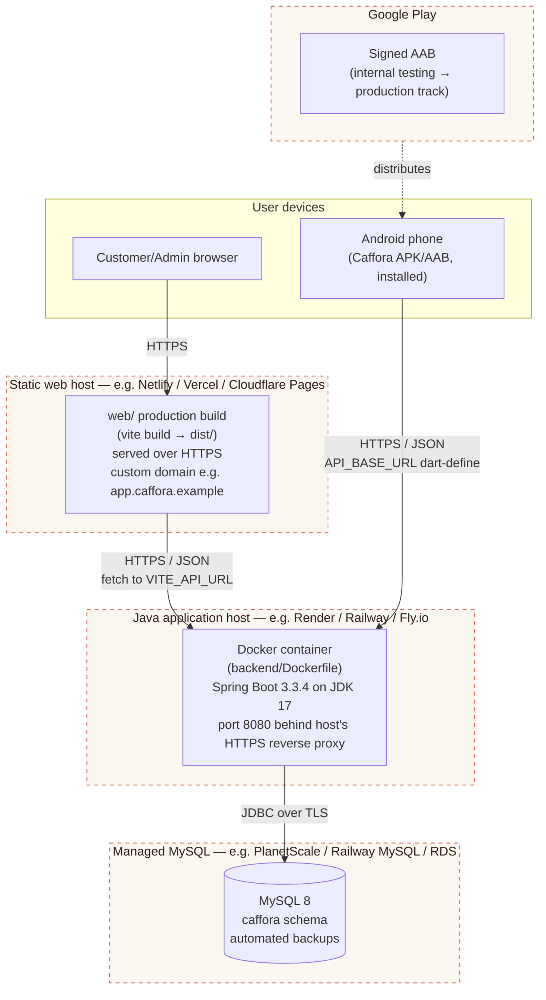

# Deployment Diagram — Target Production Topology

This describes the topology Caffora is designed to run under in production.
**No infrastructure below has actually been provisioned as part of this
documentation pass** — every box marked "manual step" is something the team
must do themselves (create an account, provision a service, set real
secrets) before a public URL exists. This is intentionally so: committing
real credentials or standing up a paid service is not something to fake in
documentation.

## Target topology

Dashed borders mark infrastructure that requires an actual account/payment
method/DNS the team must set up manually — see the "Manual deployment
steps" table below.

## Component-to-host mapping

| Component | What ships | Where it runs (target) | Config surface |
|---|---|---|---|
| Web app | Static build output of `web/` (`npm run build` → `web/dist/`) | Static host with HTTPS + CDN (Netlify, Vercel, or Cloudflare Pages) | `VITE_API_URL` set at build time to the backend's public HTTPS URL |
| Backend API | `backend/Dockerfile` image, built from the existing `docker-compose.yml` service definition | Container host with a public HTTPS endpoint (Render, Railway, Fly.io, or any Docker-capable VPS behind a reverse proxy) | `DB_HOST, DB_PORT, DB_NAME, DB_USERNAME, DB_PASSWORD, JWT_SECRET, JWT_EXPIRATION_MS, CORS_ALLOWED_ORIGINS, ADMIN_SEED_EMAIL, ADMIN_SEED_PASSWORD` as host-level environment variables/secrets — never in source control |
| Database | MySQL 8 schema (see `docs/database/schema.sql`) | Managed MySQL instance separate from the app container, so the database survives app redeploys/restarts (PlanetScale, a cloud provider's managed MySQL, or the app host's own managed MySQL add-on) | Connection string + credentials injected into the backend's env vars only |
| Mobile app | `flutter build appbundle` output, signed | Distributed via Google Play (internal testing track first, then production) | `API_BASE_URL` baked in at build time via `--dart-define=API_BASE_URL=https://api.caffora.example/api` pointing at the same backend as the web app |

## Why this shape

- **The API container is the only thing that can reach MySQL.** The
  database is never exposed on a public port to the internet at large;
  only the backend's outbound connection reaches it (see
  `docs/architecture/system-context.md` for the trust-boundary rationale).
- **Web and mobile are both "dumb" HTTPS clients of the same API URL.**
  Neither has its own backend logic or its own copy of the database, so
  there is exactly one place to patch a bug, one place to enforce a role
  check, and one schema to migrate.
- **Docker packaging (already present in `backend/Dockerfile` and
  `backend/docker-compose.yml`)** makes the backend host-agnostic: any
  container-capable PaaS can run it without bespoke server setup, and the
  same image that runs `docker compose up` locally for development is what
  would be deployed to production.
- **Static hosting for the web app** is appropriate because the React app
  is a pure client-side SPA after build (no server-side rendering
  requirement) — it only needs a CDN and HTTPS, not a Node runtime.

## Manual deployment steps (team to complete — not done here)

| Step | Why it can't be done in this documentation pass |
|---|---|
| Create accounts with a chosen web host, app host, and managed MySQL provider | Requires real payment/identity details and a human decision on which provider to use |
| Provision the actual MySQL instance and record its connection string | Requires a live, billed database service |
| Generate a production `JWT_SECRET` (e.g. `openssl rand -base64 48`) and store it only as a host secret | Must be a real secret never written to any file the team shares |
| Point a real domain (e.g. `app.caffora.example`) at the web host and `api.caffora.example` at the backend host, with TLS certificates | Requires owning/registering a domain |
| Set `CORS_ALLOWED_ORIGINS` on the deployed backend to the real production web origin (not `localhost`) | Depends on the domain chosen above |
| Set `VITE_API_URL` at web build time and `API_BASE_URL` at mobile build time to the real backend URL | Depends on the backend's real deployed URL |
| Generate and securely store the Android signing keystore (see `docs/publishing/publishing-plan.md`) | Must never be committed to source control; is a one-time manual secret-generation step |
| Create a Google Play Developer account (one-off USD 25 registration fee) | Requires a real payment and identity verification |

Until these are completed, the system is fully runnable and demonstrable
**locally** (`docker compose up --build` for the backend + MySQL, `npm run
dev` for the web app, `flutter run` for the mobile app against an emulator
or device on the same network) — see the root `README.md` for exact
commands.
