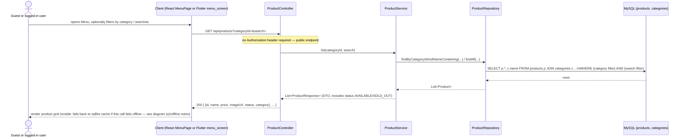
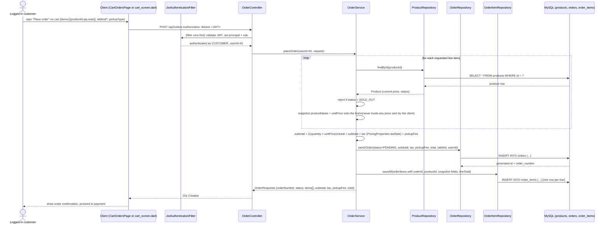
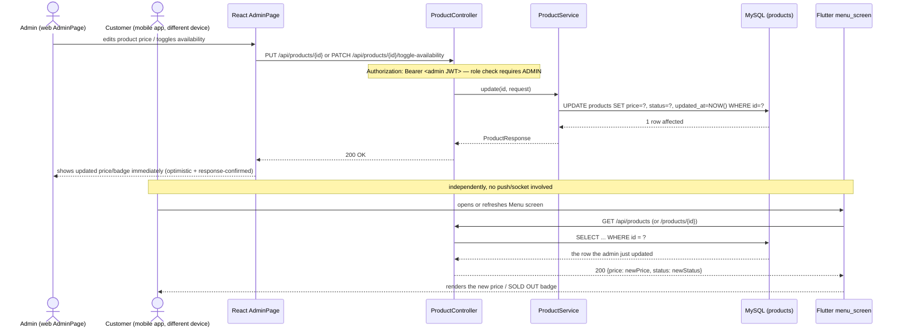
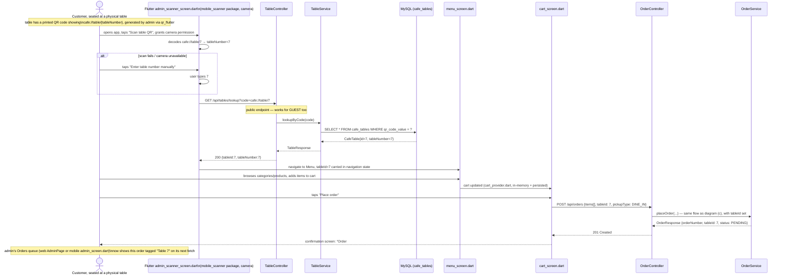

# Sequence Diagrams

Five key runtime flows through the Caffora system. All requests go through
`backend/.../security/JwtAuthenticationFilter.java` before reaching a
controller; that filter is omitted from most diagrams below for clarity
except where it is the point being illustrated (diagram a).

## (a) Login

```mermaid
sequenceDiagram
    actor U as User (web or mobile)
    participant C as Client (React or Flutter)
    participant F as JwtAuthenticationFilter
    participant AC as AuthController
    participant AS as AuthService
    participant UR as UserRepository
    participant DB as MySQL (users)

    U->>C: enters email + password
    C->>AC: POST /api/auth/login {email, password}
    Note over F: unauthenticated route — filter passes request through
    AC->>AS: login(request)
    AS->>UR: findByEmail(email)
    UR->>DB: SELECT * FROM users WHERE email = ?
    DB-->>UR: user row (or none)
    UR-->>AS: Optional<User>
    alt user not found or BCrypt password mismatch
        AS-->>AC: throws BadCredentialsException
        AC-->>C: 401 {message: "Invalid email or password"}
        C-->>U: show error
    else credentials valid
        AS->>AS: JwtService.generateToken(user.id, user.role)
        AS-->>AC: AuthResponse {token, user}
        AC-->>C: 200 {token, user}
        C->>C: store JWT (web: AppContext/localStorage; mobile: shared_preferences via session_service.dart)
        C-->>U: navigate to home, role-aware nav shown
    end
```

## (b) Product retrieval (public / guest-accessible)



## (c) Order placement (authenticated customer)



**Why the total is recomputed server-side, not trusted from the client:**
the request body carries only `productId`, `quantity`, and an optional
`note` per line — never a price. `OrderService` re-reads the authoritative
`unit_price` from the `products` table at the moment of order placement and
computes every monetary figure itself. This is the multi-table calculation
evidence item #1 referenced in the traceability matrix.

## (d) Admin product update reflected to another client



Caffora uses a **pull-based** consistency model: there is no WebSocket or
push layer. Because both clients read from the same MySQL row through the
same API, the mobile customer sees the admin's change on their very next
fetch (page load, pull-to-refresh, or the periodic `orderPollInterval` used
for order-status screens) — not instantly like a live push, but always
correctly, since there is only one row to disagree about. This trade-off
and its limitation are called out explicitly in `DEMONSTRATION.md`'s
"known limitations" section.

## (e) Table-QR scan → menu → dine-in order (end to end)



If the network is unavailable at any point in this flow, the mobile app
falls back to its `sqflite` cache for menu browsing (via
`connectivity_provider.dart` + `local_db_service.dart`) and shows the
"offline — showing cached data" banner (`offline_banner.dart`); order
*placement* itself requires connectivity, since it must reach the
authoritative backend.
