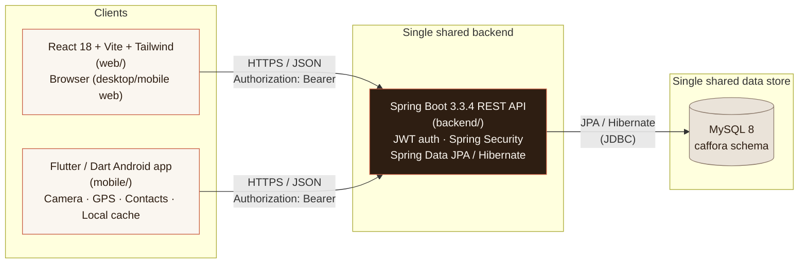

# System Context — Caffora Cafe Management System

## Purpose

Caffora is a cafe ordering and management system delivered as **three client
surfaces sharing one backend and one database**:

1. **Web app** (React 18 + Vite + Tailwind) — browsing, ordering, checkout,
   and the full admin console, used from a desktop/laptop browser at the
   counter or from home.
2. **Mobile app** (Flutter/Dart, Android) — the primary in-cafe, on-the-move
   experience: scan a table's QR code, browse the menu, order, track status,
   and (for staff) manage the menu and tables from a phone.
3. **Backend API** (Spring Boot 3.3.4 / Java 17) — the single source of
   truth for authentication, business rules, pricing, and data.
4. **Database** (MySQL) — the single persistent store for users, catalogue,
   tables, orders, and payments.

## Context diagram

Both client apps talk to **the same** Spring Boot instance over plain REST
(`/api/...`), and that one instance is the **only** process that talks to
MySQL. Neither client ever opens a direct database connection, embeds a
local write-capable copy of business rules, or talks to the other client
directly.

## Why one shared backend (not two backends, or client-side logic duplication)

This is a deliberate architectural decision, not an accident of how the
team divided work, for four concrete reasons:

1. **Single source of truth for data.** Orders, products, tables, and
   payments must be consistent regardless of which client touched them.
   If the web app and the mobile app each held a private copy of "today's
   orders" or "current stock," they would drift out of sync the moment two
   customers order from different devices at the same time — which, in a
   real cafe, is the *normal* case. Routing every read and write through one
   API onto one MySQL schema means there is exactly one row that represents
   "order #1042," never two.

2. **No duplicated, divergent business logic.** Rules like *"total =
   Σ(quantity × unit_price) + tax + pickup_fee, computed server-side"* or
   *"only ADMIN may change order status"* live in exactly one place:
   `OrderService` and `SecurityConfig` in the backend. If pricing logic were
   re-implemented independently in JavaScript (web) and Dart (mobile), the
   two would eventually disagree — e.g. after a tax-rate change is shipped
   to the web app but not the mobile app — and a customer could see two
   different totals for the same cart depending on which device they used.
   With one backend, both clients call the same endpoint and get the same
   number, guaranteed.

3. **Consistent, server-enforced authorization.** Role checks (ADMIN vs
   CUSTOMER vs GUEST) are applied once, in Spring Security filters and
   `@PreAuthorize`-style route rules, and apply identically no matter which
   client made the request. A client-side "hide the admin button" check is
   never trusted as the actual security boundary — the same JWT and the
   same role claim are validated for every request, from either app. This
   is what makes "never trust the frontend" (stated in the security section
   of the architecture docs) actually true in practice, not just a slogan.

4. **Real-time-enough cross-client consistency.** Because both clients read
   from the same live database through the same API, an admin marking a
   product `SOLD_OUT` from the web console is immediately visible to the
   next `GET /products` call from the mobile app — no sync job, no export,
   no second copy to reconcile. This is the mechanism behind the
   cross-client-update-reflection requirement (see
   `docs/architecture/sequence-diagrams.md`, diagram (d), and the
   traceability matrix).

## Trust boundaries

- **Client → API**: crosses the public internet (or a LAN in dev). Always
  HTTPS in any real deployment; carries a bearer JWT for authenticated
  requests; CORS restricts which web origins may call the API at all.
- **API → Database**: stays inside the backend's private network/host; the
  only credentials that can reach MySQL are the backend's own
  `DB_USERNAME`/`DB_PASSWORD`, supplied via environment variables, never
  hard-coded and never exposed to a client.
- **GUEST** traffic (unauthenticated) is allowed only against the public
  read endpoints (`/auth/register`, `/auth/login`, `GET /categories`,
  `GET /products`, `GET /products/{id}`, `GET /tables/lookup`); everything
  else requires a valid JWT, and admin-only routes additionally require the
  `ADMIN` role claim inside that JWT.
