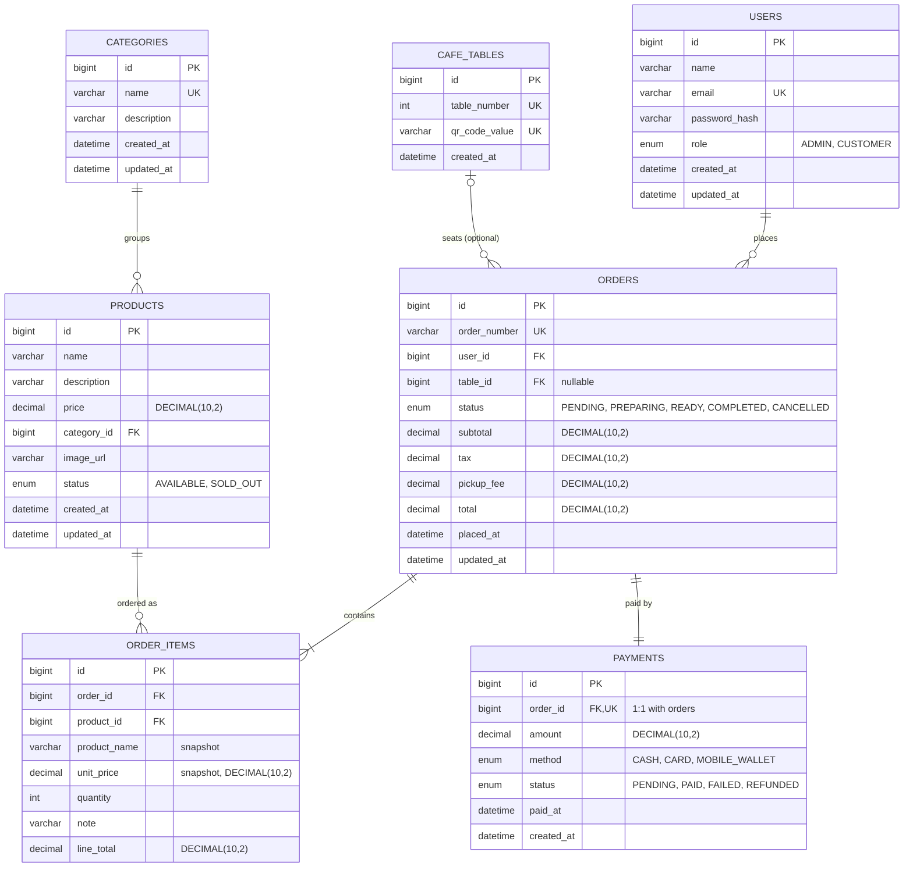

# Entity-Relationship Diagram

Caffora's MySQL schema has **7 tables**, exceeding the assignment's minimum
of 4. This document is the authoritative description of the schema;
`docs/database/schema.sql` implements it exactly.

## Relationships and rationale

### `users` 1 — N `orders`
Every order is placed by exactly one authenticated user (`orders.user_id`
is `NOT NULL`, `FK → users.id`). Guests cannot place orders — they must
register/login first, which is enforced both at the API layer (`POST
/orders` requires a valid JWT) and structurally by this foreign key having
no nullable path. One user may place many orders over time.

### `categories` 1 — N `products`
Every product belongs to exactly one category (`products.category_id NOT
NULL, FK → categories.id`) so the menu can be filtered/grouped
(`GET /products?categoryId=`). Categories are admin-managed and have a
unique `name` so the catalogue cannot end up with two categories that only
differ by an admin's typo.

### `cafe_tables` 0/1 — N `orders` (nullable FK)
`orders.table_id` is **nullable** because Caffora supports two order modes:
**dine-in**, where the order is tied to a physical table scanned via QR
(`table_id` set), and **pickup**, where there is no physical table at all
(`table_id` is `NULL`, and `pickup_fee` is charged instead). Making the
column nullable rather than forcing a placeholder "no table" row keeps the
data model honest — a pickup order genuinely has no table — and lets a
single query (`WHERE table_id IS NOT NULL`) distinguish dine-in from pickup
orders for the admin console and reports.

### `orders` 1 — N `order_items`
Each order line is its own row, one per distinct product+note combination
in the cart. This is what allows an order to contain multiple different
products at multiple quantities, and is the primary table joined by the
sales/top-products reports.

### `products` 1 — N `order_items`, with **snapshotting**
`order_items` stores its own `product_name` and `unit_price` **in addition
to** the `product_id` foreign key. This is intentional denormalization: if
an admin edits a product's name or price *after* an order was placed, that
historical order must still show what the customer actually paid at the
time, not today's price. The live `products.price` is authoritative only
at the moment `OrderService` builds a new order; once an `order_items` row
exists, its `unit_price`/`product_name` are immutable snapshots. This is
also why `order_items.product_id` has no `ON DELETE CASCADE` behavior that
would silently corrupt historical orders — see `schema.sql` for the exact
FK action used.

### `orders` 1 — 1 `payments`
`payments.order_id` carries a `UNIQUE` constraint, not just a plain FK, so
the relationship is enforced as strictly one-to-one at the database level:
an order is paid for exactly once (payment attempts/retries update the
existing `payments` row's `status`, they don't create new rows). This
matches the domain: Caffora's payment step is a **simulated, instant-success
capture** (`POST /payments`, no real payment gateway integration), and
modeling it as its own table — rather than just columns on `orders` — keeps
payment method/status/timestamp concerns cleanly separated from order
fulfilment status (`PENDING → PREPARING → READY → COMPLETED`), which is a
completely independent state machine driven by the kitchen/admin, not by
payment.

## Indexes (see `schema.sql` for the DDL)

Beyond the primary keys and unique constraints implied above, the schema
adds indexes on `orders.status`, `orders.user_id`, `order_items.order_id`,
and `order_items.product_id` — these are exactly the columns the hot-path
queries filter or join on: the admin's "active orders" queue
(`GET /orders?active=true` → `WHERE status IN (...)`), a customer's order
history (`GET /orders/my` → `WHERE user_id = ?`), and both reporting
endpoints (`GROUP BY` over `order_items` joined to `orders`/`products`).
