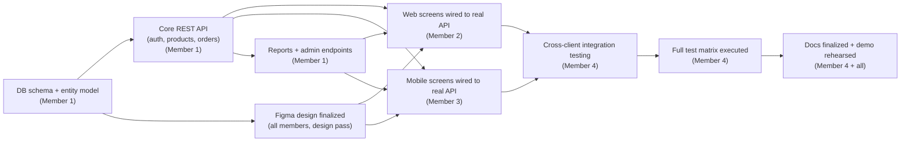

# Project Plan — Caffora (COMP70070/COMP70071 Group Coursework)

**Deadline:** 27 September 2026. **Plan authored:** 18 September 2026 (see
note on timeline realism at the end of this document).

## Team roles

The team has up to 4 members. Real names are not filled in here — this is
explicitly left for the team, per the instruction not to invent facts that
require a real human decision. Role placeholders are used consistently
across all documentation:

| Placeholder | Primary responsibility | Owns |
|---|---|---|
| **Member 1** | Coordination, backend, database | Project coordination/scope decisions, `backend/` (Spring Boot API, security, services), `docs/database/`, environment/config (`.env.example`, `application.yml`) |
| **Member 2** | React web app | `web/` (pages, API client layer, Tailwind styling, admin console UI), consuming the Figma design for desktop/web breakpoints |
| **Member 3** | Flutter mobile app | `mobile/` (screens, providers, services, device-feature integrations: camera/QR, geolocation, contacts, offline cache, theming) |
| **Member 4** | Testing, documentation, DevOps, integration | `docs/` as a whole, `docs/testing/test-plan.md` execution, Docker/deployment setup, cross-client integration checks, demo rehearsal |

In practice all members review and contribute across boundaries (e.g.
Member 1 defines the API contract that Members 2 and 3 both build against;
Member 4 files bugs against whichever codebase they surface in) — the table
above states primary ownership, not exclusivity.

## Responsibilities in detail

- **Member 1 (coordination/backend/database):** owns the entity model and
  migrations, JWT/Spring Security configuration, all REST endpoints and
  their validation/error handling, the reporting/dashboard aggregate
  queries, and keeps `docs/database/erd.md`/`schema.sql` in sync with the
  real entities. Also runs weekly check-ins and tracks task status.
- **Member 2 (web):** implements every screen against the real API
  (replacing any placeholder/mock data in `web/src/data/menuData.js` with
  live calls through `web/src/api/`), builds the admin console (catalogue
  CRUD, table management, order queue, reports), and matches the Figma
  light/dark and responsive breakpoints in Tailwind.
- **Member 3 (mobile):** builds the Flutter screens and providers, wires
  the QR-scan-to-table-order flow (`mobile_scanner`, `qr_flutter`), the
  offline cache (`sqflite` + `connectivity_plus`), light/dark theming
  (`shared_preferences`), and the geolocation/contacts device features.
- **Member 4 (testing/documentation/DevOps/integration):** executes the
  test matrix in `docs/testing/test-plan.md` against a running stack, owns
  `docker-compose.yml`/deployment docs, verifies the web and mobile apps
  both function correctly against one shared backend instance (not two
  divergent local copies), and assembles/rehearses `DEMONSTRATION.md`.

## Task dependencies

The critical dependency: **web and mobile cannot be meaningfully built
until the backend's API contract is stable**, which is why backend-core
work is front-loaded in Week 2 below and why both clients build in
parallel once that contract exists, rather than sequentially.

## Milestone timeline

Today is **18 September 2026**; the deadline is **27 September 2026** —
9 calendar days remain. The plan below compresses the original 6-week
shape into the days actually available, on the assumption that Figma
design, database design, and initial backend scaffolding (visible in the
current repository state) are already substantially underway or done, and
that the remaining work is finishing implementation, integration, testing,
and documentation.

| Milestone | Target dates | Deliverables |
|---|---|---|
| **M1 — Backend feature-complete** | 18–19 Sep 2026 | `Category`/`Product`/`CafeTable`/`Payment` entities finalized, `/admin/reports/*` endpoints working, `MenuItem`→`Product` rename complete across the codebase |
| **M2 — Web + mobile wired to the real API** | 19–22 Sep 2026 | Web: admin CRUD screens + real API calls replacing placeholder data. Mobile: table-scan dine-in flow, offline cache, light/dark theming — built in parallel by Members 2 and 3 against the M1 API |
| **M3 — Integration** | 22–24 Sep 2026 | Member 4 verifies both clients against one running backend instance; cross-client update reflection (diagram (d)) and the QR→order flow (diagram (e)) confirmed end to end |
| **M4 — Testing** | 24–25 Sep 2026 | `docs/testing/test-plan.md` executed for real, Actual Result/Status columns filled in, defects triaged and fixed |
| **M5 — Documentation finalized** | 25–26 Sep 2026 | All `docs/` files reviewed against the final implementation state; traceability matrix cross-checked against actual endpoints/screens |
| **M6 — Demo rehearsal + submission prep** | 26–27 Sep 2026 | `DEMONSTRATION.md` script rehearsed end to end on the actual apps; submission package assembled |
| **Deadline** | **27 Sep 2026** | Submission |

This is a compressed, realistic schedule for the days remaining, not a
padded 6-week plan — it deliberately does not assume more time than
actually exists between today and the deadline.

## Risks and mitigations

| Risk | Mitigation |
|---|---|
| Backend entity rename (`MenuItem`→`Product`) breaks web/mobile API calls mid-integration | Land the rename early (M1) before Members 2/3 build extensively against the old shape; communicate the final DTO shape before, not after, the rename |
| No real device/emulator testing performed in this documentation pass | Explicitly flagged in `docs/testing/test-plan.md`; Member 4 must execute the matrix on real hardware/emulator before submission |
| Time pressure given the short window to the deadline | Scope is fixed to the authoritative spec in this plan — no speculative extra features are added this close to the deadline |
| Play Store / production hosting requires real accounts and payment | Treated as an explicit manual, out-of-scope-for-automation step (`docs/publishing/publishing-plan.md`) so the team isn't blocked waiting on documentation for it |
