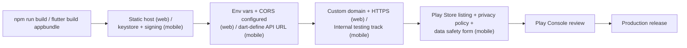

# Publishing Plan — Caffora

Covers taking the web app and the Android mobile app from a working local
build to a publicly reachable/distributable release. Steps requiring a
real account, payment, or credential are explicitly marked **[MANUAL —
team to complete]**; they are not performed in this documentation pass.

## Web app publishing

1. **Production build.** From `web/`:
   ```
   npm install
   npm run build
   ```
   This runs `vite build` (per `web/package.json`) and emits static output
   to `web/dist/` — plain HTML/CSS/JS with no server-side runtime
   requirement, already present in the repo as `web/dist/` from a prior
   build.
2. **Static hosting.** Upload/connect `web/dist/` to a static host with
   built-in HTTPS (Netlify, Vercel, or Cloudflare Pages are all suitable —
   see `docs/architecture/deployment-diagram.md` for the reasoning). All
   three give free HTTPS on their default subdomain and support a custom
   domain.
3. **Environment configuration at the host.** Set `VITE_API_URL` as a
   build-time environment variable on the host to the backend's real
   public HTTPS URL (e.g. `https://api.caffora.example/api`) — this value
   is baked into the built JS at `npm run build` time (see
   `web/src/api/client.js`), so it must be set **before** each production
   build, not adjusted afterward.
4. **Custom domain + HTTPS.** **[MANUAL — team to complete]** Point a real
   domain at the static host and let the host issue/renew a TLS
   certificate (all three suggested hosts automate this via Let's Encrypt).
5. **Backend CORS update.** Once the real web domain is live, set
   `CORS_ALLOWED_ORIGINS` on the deployed backend to include it (not just
   `localhost`), per `.env.example`.

## Android app publishing

1. **Production build.**
   ```
   cd mobile
   flutter build appbundle --dart-define=API_BASE_URL=https://api.caffora.example/api
   ```
   This produces a signed-ready Android App Bundle (`.aab`), the format
   Google Play requires (rather than a raw `.apk`).
2. **App signing.** **[MANUAL — team to complete]** Generate an upload
   keystore:
   ```
   keytool -genkey -v -keystore upload-keystore.jks -keyalg RSA \
     -keysize 2048 -validity 10000 -alias upload
   ```
   Reference it from `android/key.properties` (path, alias, passwords) per
   Flutter's standard Android signing setup. **This keystore and
   `key.properties` must never be committed to source control** — add them
   to `.gitignore` alongside the backend's existing `.env` exclusion, and
   store the keystore file and its passwords in a password manager or CI
   secret store, not in the repository or in chat/email. Losing this key
   means losing the ability to publish updates to the same app listing, so
   it also needs a secure backup outside any single team member's laptop.
3. **Internal testing track first.** **[MANUAL — team to complete, needs a
   Play Console account]** Upload the `.aab` to Google Play Console's
   **Internal testing** track before any production release. This lets the
   team (and a small tester group) install and verify the real signed
   build via a private opt-in link before it is visible to the public,
   catching signing/permission/config issues that don't appear in a debug
   build.
4. **Play Store listing requirements.** **[MANUAL — team to complete]**
   - **Screenshots**: at minimum phone screenshots of Home, Menu, Cart,
     Order tracking, and the QR-scan screen, in both light and dark mode
     if showcasing theming.
   - **Privacy policy**: **must be authored** (does not exist yet) because
     the app requests camera (QR scanning), location (distance-to-cafe),
     and contacts (invite-a-friend) permissions — Play Console requires a
     published privacy policy URL disclosing what each permission is used
     for before the app can go live, even in internal testing for
     sensitive permissions.
   - **Short description / full description**: marketing copy describing
     the QR-scan-to-order flow and admin features, distinct from the
     technical README.
   - **Content rating questionnaire**: completed in Play Console; Caffora
     has no user-generated content, violence, or age-restricted material,
     so it should qualify for a low/all-ages rating, but the questionnaire
     itself must be completed by a real account holder.
   - **Data safety form**: must accurately disclose exactly which device
     capabilities are used and why:

     | Data/permission | Used for | Shared with third parties? |
     |---|---|---|
     | Camera | Scanning a table's QR code to identify a dine-in table (`mobile_scanner`) | No |
     | Precise/approximate location | Showing distance-to-cafe on the Profile screen (`geolocator`) | No |
     | Contacts (read, on explicit user action) | Selecting a contact to send an "Invite a friend" referral (`flutter_contacts`) | No — read locally to populate a picker, not uploaded in bulk |
     | Account info (name, email) | Registration/login, order history (`users` table) | No |
     | Order/payment data | Placing and tracking orders (`orders`, `payments` tables) | No (payment is simulated, no external payment processor is integrated) |

5. **Play Console review/approval process (high level).** **[MANUAL — team
   to complete]** After submitting the listing and the internal-testing
   build: Google runs an automated + policy review (typically hours to a
   few days) before an app can move from internal testing to a
   production/closed track; permissions like camera, location, and
   contacts attract extra policy scrutiny, so the privacy policy and data
   safety form must accurately match what the code actually does (see
   table above) or the review will be rejected. A **Google Play Developer
   account** (one-time ~USD 25 registration fee, identity verification)
   is a prerequisite for any of this and must be created by a real team
   member.

## Sequencing summary



Everything up to and including step **A** (production builds) can be done
without any external account. Every step from **B** onward for the mobile
app, and the domain/HTTPS step for the web app, requires a real account,
payment, or credential the team must create — these are the items marked
**[MANUAL — team to complete]** above and are not something this
documentation pass can complete on the team's behalf.
